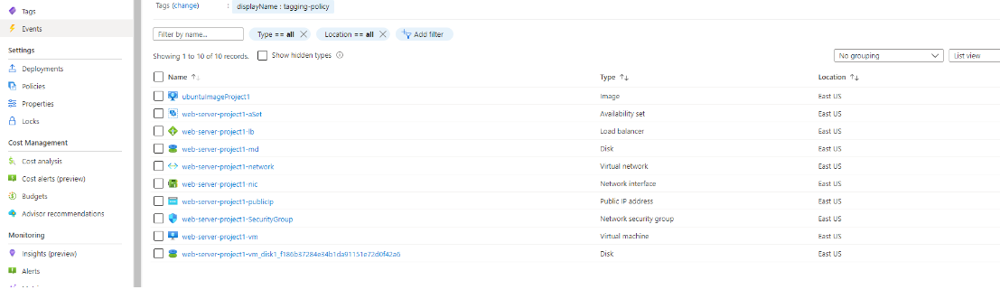

# Azure Infrastructure Operations Project: Deploying a scalable IaaS web server in Azure

## Introduction

This project is for writing a Packer template and a Terraform template to deploy a customizable, scalable web server in Azure. The Packer template allows us to create an image that will allow us to create multiple virtual machines at the 
same time through Terraform, which will contain all of our infrastructure to be deployed, including: storage, security, and networking configurations.   

## Getting Started

To begin using this project, start with these steps:
1. Clone this repository
2. Create your infrastructure as code
3. Create your tagging policy in Azure
4. Create your resource group in Azure

## Dependencies

1. Create and Azure Account
2. Install the Azure CLI
3. Install Packer
4. Install Terraform

## Instructions
After the dependencies have been create or installed, it's time to create and deploy the Packer and Terraform templates

### Deploy the Packer Image Template

Packer deploys virtual machine images which can be used to create multiple virtual machines. 

#### Configure your environment variables
The packer image is created using the server-template.json file. The values for the client_id, client_secret, and subscription_id variables in this file will be unique to you, and you can get them, and assign
them as environment variables by following these steps:

* Log into your Azure account
* To get the client_id and client_secret details, in the Azure CLI run command **az ad sp create-for-rbac**

The output should look something like this:

```
{
    "client_id": "f5b6a5cf-fbdf-4a9f-b3bTestId",
    "client_secret": "0e760437-bf34-4aad-9f8d-87TestId",
}
```

* For the subscription_id variable, you'll need your Azure subscription code. To get that, in the Azure CLI run **az account list** and copy the value from the "id" field. You can also go into the Azure portal and search
for subscriptions to get your subscription id. 
* Now these three values must be set as environment variables, which can be accomplished by going to the terminal and running

```
{
	export ARM_CLIENT_ID=f5b6a5cf-fbdf-4a9f-b3bTestId
	export ARM_CLIENT_SECRET=0e760437-bf34-4aad-9f8d-87TestId
	export ARM_SUBSCRIPTION_ID=95be8865-t329-5e6TestId
}
```

#### Deploy the Packer Image

To deploy the image, in the Azure CLI run the command **packer build server.json**, which should have output similar to the following:


## Deploy Infrastructure With Terraform

Terraform is used to quickly deploy all of our infrastructure, which is listed in the main.tf file, and also utilizes variables in the vars.tf file. The packer image is referenced in the variables section and is used in the 
template to create our virtual machines. 

### First, and example about how to change and use the variables. 
In the vars.tf file are variables that can be used in the main.tf. In vars.tf it would look something like this:

```
variable "location" {
    description = "The location to be used for all resources"
    default = "East US"
}
```

And in the main.tf file it would be used like this:

```
location = var.location
```

### Deploy the Infrastructure with Terraform

To deploy, perform the following steps:

* In our Packer image we created a resource group, and we need to import that into Terraform before deploying, so Terraform will used that resource group, instead of trying to create another resource group with the same name, which
isn't allowed. To do this we need to run the command **terraform import azurerm_resource_group.main /subscriptions/{subsriptionId}/resourceGroups/{resourceGroupName}**. 
* In the Azure CLI run the command **terraform plan -out solution.plan** to review what infrastructure will be deployed and saved to disk.


* In the Azure CLI run the command **terraform apply** to deploy the infrastructure. 

## Output
If everything deployed correctly, you should see a message like this after running **terraform apply**


Then to confirm the resources were created when you run command **terraform show** the output should look something like this:


And in the Azure Portal it should look something like this:



* Once the infrastructure has successfully been deployed, we want to then destroy the infrastructure. In the Azure CLI run the command **terraform destroy**. 
* Run **terraform show** again to confirm all resources have been destroyed.


